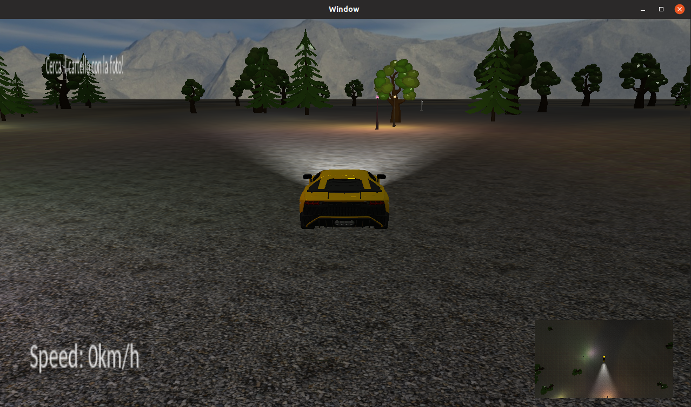

# Game

## Il Gioco

Prima di parlare delle classi che compongono questo modulo è arrivato finalmente il momento di discutere del gioco vero e proprio.



Ci troviamo in questo "bellissimo" mondo notturno alla guida della nostra lamborghini, ed il nostro compito sarà quello di scovare fra gli alberi il cartello con la foto del ricercato (ovvero lo sviluppatore di questo software). Una volta trovato il cartello basterà passarci sopra con la vettura per vincere il gioco, e da quel momento in poi sarà possibile anche cambiare la scena da notte a giorno.

Come possiamo vedere dall'immagine abbiamo:

-   In alto a sinistra l'obbiettivo da raggiungere, mentre in basso abbiamo la velocità attuale della macchina.
-   In basso a destra è presente la scena vista dall'alto, possiamo quindi vederla come una piccola mappa.

I comandi di gioco sono:

| Comando                                                  | Tasto/i         |
| -------------------------------------------------------- | --------------- |
| Bloccare il puntatore all'interno della finestra         | 0               |
| Cambiare la camera                                       | 1               |
| Cambiare fra vista solida e wireframe                    | 2               |
| Attivare/Disattivare tutto il testo a schermo            | 3               |
| Attivare/Disattivare solamente le info e non la velocità | P               |
| Attivare/Disattivare la notte (solo una volta vinto)     | N               |
| Attivare/Disattivare la minimappa                        | M               |
| Chiudere il gioco                                        | ESC             |
| Muovere la camera libera                                 | A S D W         |
| Routare la camera libera                                 | movimento mouse |
| Accendere/Spegnere le luci della macchina                | U               |
| Muovere la macchina                                      | J K L I         |

## Le classi del modulo

### `Car`

Questa classe estende la classe `GameObject` e ne estende il metodo `Update()` in modo da effettuare tutti i calcoli per modificare la posizione della macchina, all'interno della scena, in base agli input dati dal giocatore (abbiamo preso spunto dal codice d'esempio visto a lezione). Dato che la macchina possiede anche delle luci anteriori all'interno della stessa funzione viene aggiornata anche la loro posizione.

### `Minimap`

La minimappa rappresenta il mondo di gioco visto dall'alto. Per creare questo elemento della GUI è stato scelto di renderizzare la scena in un _Frame Buffer_ apposito, poi utilizzato come texture per un quad da posizionere in basso a destra.

La funzione che permette di creare il Frame Buffer e di conseguenza la minimap è la seguente:

```cpp
bool Minimap::CreateMinimapTarget()
{
    auto window = _game->GetWindow();

    auto width = window->GetWidth() * _ratio;
    auto height = window->GetHeight() * _ratio;

    glGenFramebuffers(1, &_framebuffer);
    glBindFramebuffer(GL_FRAMEBUFFER, _framebuffer);

    _texture = new Graphics::Texture();
    _texture->CreateForRendering(width, height, GL_RGB);

    glGenRenderbuffers(1, &_renderbuffer);
    glBindRenderbuffer(GL_RENDERBUFFER, _renderbuffer);
    glRenderbufferStorage(GL_RENDERBUFFER, GL_DEPTH24_STENCIL8, width, height);
    glFramebufferRenderbuffer(GL_FRAMEBUFFER, GL_DEPTH_ATTACHMENT,
                                GL_RENDERBUFFER, _renderbuffer);

    if (glCheckFramebufferStatus(GL_FRAMEBUFFER) != GL_FRAMEBUFFER_COMPLETE)
    {
        glDeleteFramebuffers(1, &_framebuffer);
        _texture->Unload();
        delete _texture;
        _texture = nullptr;

        return false;
    }

    return true;
}
```

### `Menu`

La classe in questione è quella che si occupa di disegnare a schermo sia il testo con la velocità della macchina che l'obbiettivo del gioco. Quest'ultimo verrà modificato nella scritta "Hai Vinto" in caso di vittoria. Per disegnare testo a schermo, la classe estende l'oggetto base `GuiComponent` il quale mette a disposizione alcuni metodi per disegnare il testo su delle texture le quali verranno applicata ad un quad renderizzato sopra la scena 3D.

### `StaticObject`

Questa classe viene utilizzate per gli oggetti statici come alberi, il cartello e i lampioni. Per questo motivo si tratta di una classe quasi vuota. L'unica differenza con la classe `GameObject` dalla quale deriva è quella di passare lo shader al modello da disegnare (vedi metodo `Draw()`).
